# Gallery

Sites and tools shipped with the `front-*` skill suite. Each entry is
a real, public surface — not a mock or a screenshot of the demo
component library. Light and dark variants are captured headlessly so
the dark-mode peer rule is visibly enforced.

Markdown-based by design: every entry lives in this file, every
screenshot lives under `assets/gallery/<slug>/`, every link points to
the live URL. No CMS, no separate showcase site, no build step.

To submit a new entry, see [Adding to the gallery](#adding-to-the-gallery)
at the bottom of this file.

## [md2star — Markdown → branded `.docx` / `.pptx` / `.pdf`](https://github.com/warith-harchaoui/md2star)

> *Convert Markdown into branded `.docx`, `.pptx`, and `.pdf`, end to end.*

A cross-platform CLI + local web GUI that wraps **Pandoc** with a
curated styling layer: a single `.md` file becomes a polished Office
document. The CLI (`md2docx`, `md2pptx`, `md2pdf`) does the
non-interactive case; the live editor shown below is the
**Overleaf-style split pane** — Markdown source on the left, PDF
preview on the right, debounced 500 ms after typing with `⌘ Enter` /
`Ctrl Enter` to force, `⌘ S` to download. The render pipeline is the
same one the CLI uses: `md2docx` produces the .docx, headless
LibreOffice (`soffice --convert-to pdf`) renders the PDF, then
**pdf.js paints each page into a `<canvas>`** — so the preview shows
up identically in real Chrome/Firefox/Safari *and* in headless Chrome
(the previous `<iframe src=blob:pdf>` approach silently broke under
headless because the browser PDF viewer plugin is absent there).

The split adds a **draggable divider** with keyboard resize
(`←` / `→` on the focused separator, ratio persisted to
`localStorage`), a **cycling theme toggle** (`light → dark → auto`,
also selectable via `?theme=…` URL param — how the gallery captures
below were shot headlessly), and a **Download PDF** button (and
Markdown source autosave) so the editor state survives a reload.
A header **DOCX / PPTX toggle** switches the output format on the
fly; each format keeps its own autosave buffer, and on first launch
the editor loads the canonical example bundled with the CLI —
`md2star/data/example.md` (Musk's five-step engineering algorithm)
for DOCX, `md2star/data/example_pptx.md` (Guy Kawasaki's 10/20/30
pitch-deck template) for PPTX — via a `GET /example?kind=…`
endpoint, so the very first render of either mode exercises the
pipeline against real content.

Why this entry matters for the gallery: md2star is the concrete
**CLI → GUI** target the `front-cli-gui` skill was designed for —
real CLI surface, real local web GUI, dark-mode peer on every panel,
no framework runtime. The backend is stdlib-only (Python's
`http.server`); the front end is a single vanilla ES module,
Tailwind Play CDN, and pdf.js from jsDelivr. The emitted HTML passes
both `front-ux-laws` and `front-accessibility` audits with zero
findings. The Tauri shell that will wrap it as a desktop application
is on the [roadmap](CHANGELOG.md#roadmap); the local-web GUI shown
below is what's live today.

*DOCX mode — Musk's five-step engineering algorithm rendered live:*

| Light | Dark |
|---|---|
| 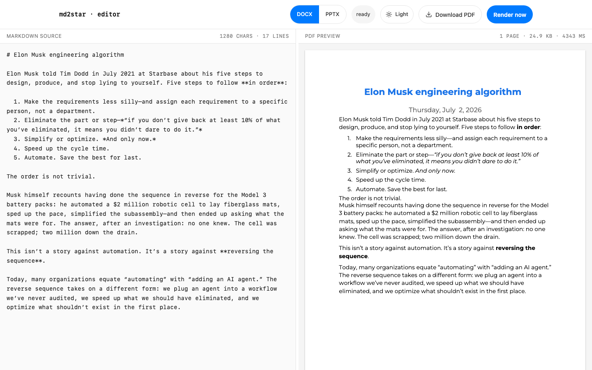 | 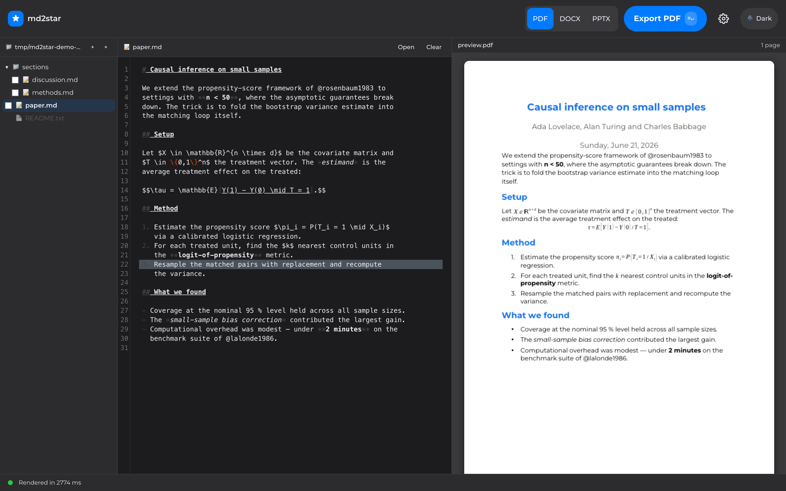 |

*PPTX mode — Kawasaki's 10/20/30 pitch deck rendered live:*

| Light | Dark |
|---|---|
| 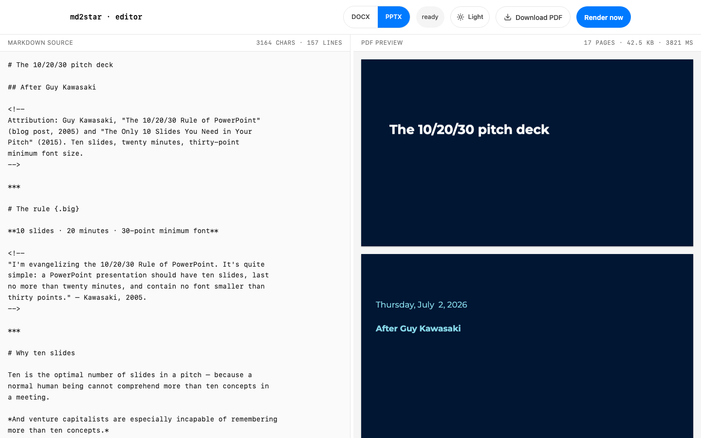 | 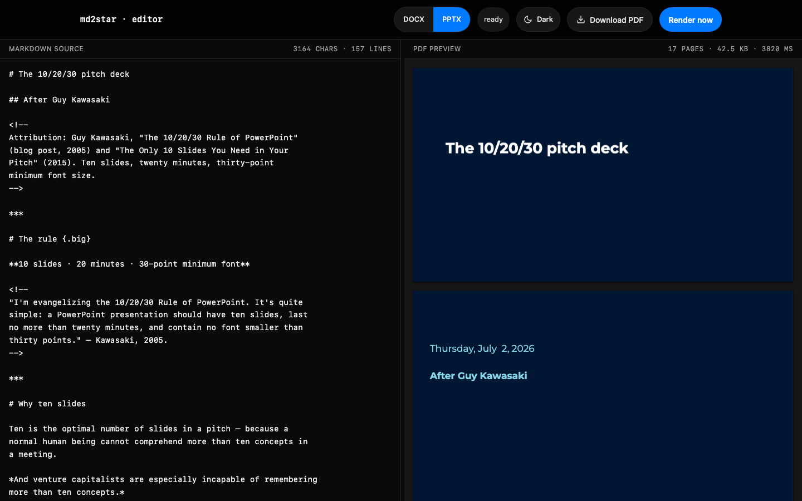 |

**Author:** [Warith Harchaoui](https://linkedin.com/in/warith-harchaoui)  ·  **Stack:** Python stdlib HTTP server + vanilla JS + Tailwind + pdf.js + `md2docx` / `md2pptx` + headless LibreOffice

## [roitelet — local-first lab for LLM / RAG / agentic systems](https://github.com/warith-harchaoui/roitelet)

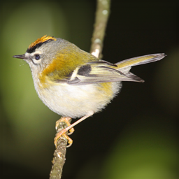

> *Several AI models answer your question at the same time, and a local model picks the best parts of each answer for you.*

A local-first workbench for designing and comparing LLM, RAG, and
agentic setups before they become client architectures. The chat UI
fans one prompt out to several models at once, then a local Ollama
"judge" synthesizes a single answer; slash-commands (`/image`,
`/personal`, `/help`) switch modes, and a companion Markdown editor
handles longer drafts. It runs entirely on the machine, bound to
`127.0.0.1` by default, and is used at deraison.ai to prototype
architectures with clients.

Why it earns its place: one **WCAG-tuned semantic token set** (surface /
label tiers, each with a `-dark` peer) is shared across every surface,
so the `dark:` peer rule holds on the chat pane, the sidebar, and the
editor alike — no framework runtime, vanilla ES modules, Tailwind JIT,
self-hosted Roboto. Captures show the fresh-install empty state.

| Light | Dark |
|---|---|
| 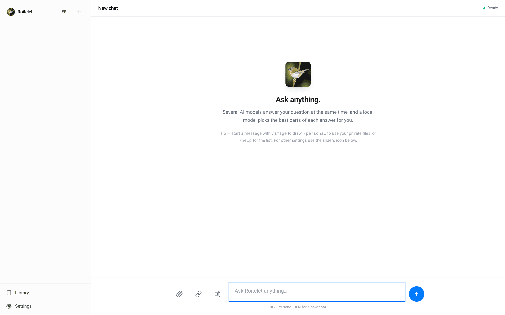 | 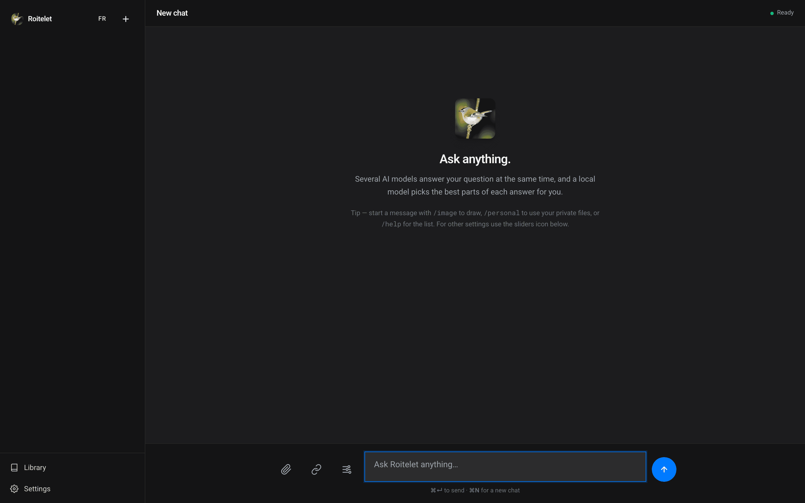 |

**Author:** [Warith Harchaoui](https://linkedin.com/in/warith-harchaoui)  ·  **Stack:** Python (FastAPI + uvicorn) + vanilla JS (no build, Tailwind JIT) + self-hosted Roboto + local Ollama

## [intentions — Déraison Assurances intent router](https://github.com/warith-harchaoui/intentions)

> *Route a caller's request to the right department by comparing three intent engines side by side — TF-IDF, BERT, and a local LLM.*

A teaching demo for intent detection: the same request runs through
TF-IDF (instant, offline), BERT embeddings (semantic), and a local LLM
(Ollama, zero-shot with strict JSON), shown with confidence bars and
latencies so the trade-offs are visible. Intents live in Markdown —
one `# h1` per intent in `knowledge_base/` — so a domain expert adds
one without touching code.

Why it earns its place: the front cites the front-ui house style in its
own source comments (`web/app.js`: "règle front-ui n°1") — vanilla ES
modules, vendored Tailwind for an offline page, three-Roboto, and a
`dark:` peer on every surface (dark capture shows the live LLM badge and
the 21-intent knowledge base).

| Light | Dark |
|---|---|
| 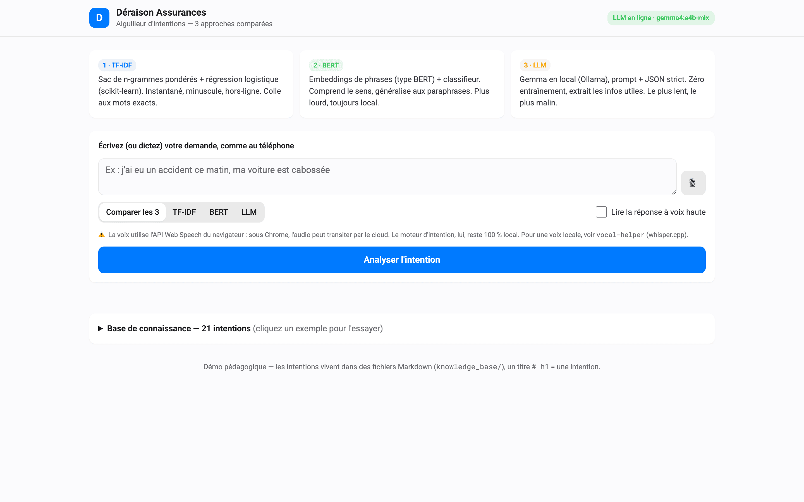 | 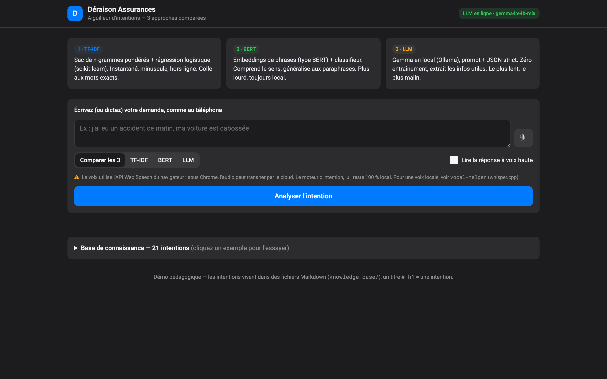 |

**Author:** [Warith Harchaoui](https://linkedin.com/in/warith-harchaoui)  ·  **Stack:** Python (FastAPI) + vanilla JS + Tailwind (vendored) + scikit-learn / sentence-transformers / local Ollama

## [sql — Text2SQL teaching demo](https://github.com/warith-harchaoui/sql)

> *French natural-language questions become SQL through three approaches — raw QwenCoder, LangChain, and Vanna RAG — 100% local via Ollama.*

A side-by-side text-to-SQL demo over a synthetic hospital database
(30 tables, fictional data). The same question is answered by three
approaches; the generated SQL is shown, run read-only (`mode=ro`,
single `SELECT`), and — when a chart fits — a local Gemma model picks a
visualization that is rendered as **Vega-Lite** (generated code is
never executed).

Why it earns its place: the front cites the front-ui house style in its
source comments and vendors Tailwind for a fully local page; the
`front-figures` philosophy shows up literally — the model chooses the
chart, the page renders it as Vega-Lite. Both color schemes carry the
full `dark:` peer set.

| Light | Dark |
|---|---|
| 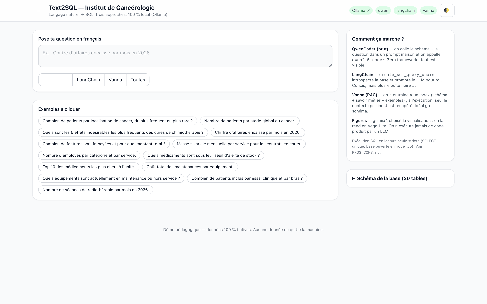 | 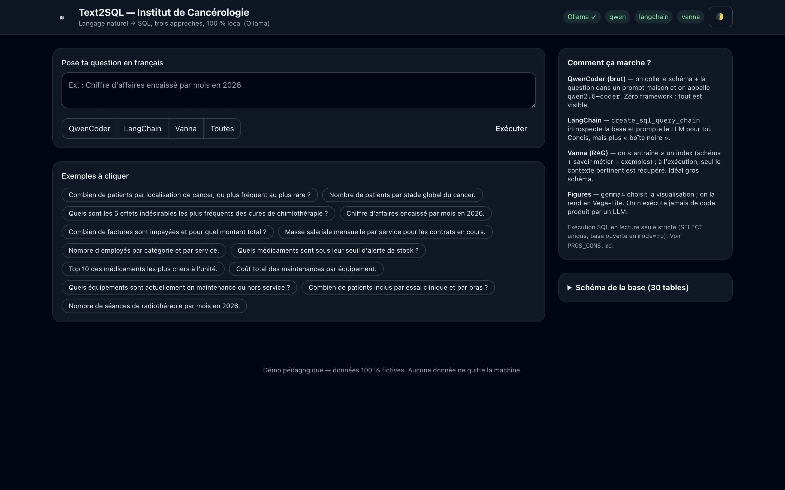 |

**Author:** [Warith Harchaoui](https://linkedin.com/in/warith-harchaoui)  ·  **Stack:** Python (FastAPI) + vanilla JS + Tailwind (vendored) + Vega-Lite + local Ollama (qwen2.5-coder / Gemma) + SQLite
