# FIGURES.md — everything the engines can draw

A catalog of the figures this skill's engines produce, from **fake data**, each
one **rendered** so you can see it rather than take it on faith. It is the
public, positive twin of the gitignored `.private/vega-failures/FAILURES.md`
(what genuinely did not work).

Together the two engines cover the everyday plotting API of **matplotlib**,
**seaborn**, and **plotly** — including the plots people assume need one of
those libraries.

## The policy: Vega first, SVG as the escape hatch

For any figure, the [Ralph Eyeball Loop](references/ralph-eyeball-loop.md) drives
the choice:

1. **Try Vega** — render the spec, look at it, refine. Vega is preferred (the
   spec carries its own data, themes to the house style, is natively
   interactive in a page).
2. **If the Vega loop can't get there**, drop to a **hand-authored SVG** — and
   run the same loop (render → look → refine). SVG covers what Vega's grammar
   can't express: smoothing filters, arrowhead markers, gradients.

Every figure below is rendered with `scripts/render_diagram.py <source> --out
<png>` — the kind (vega / svg) is auto-detected.

---

## Vega engine — everyday charts

| | |
|---|---|
| 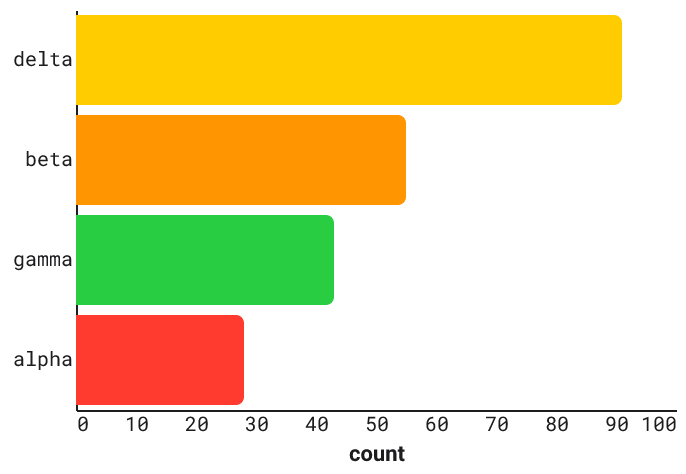 **Bar** — `plt.bar` / `sns.barplot` · `bar.vl.json` | 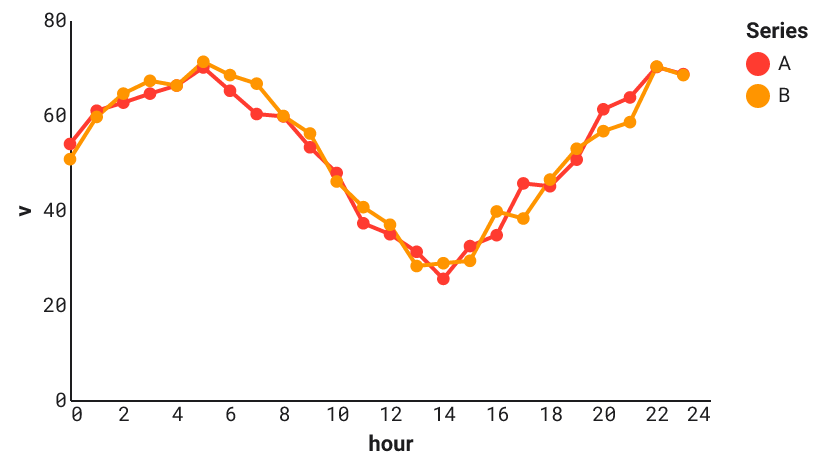 **Multi-line** — `sns.lineplot(hue=…)` · `line-multi.vl.json` |
| 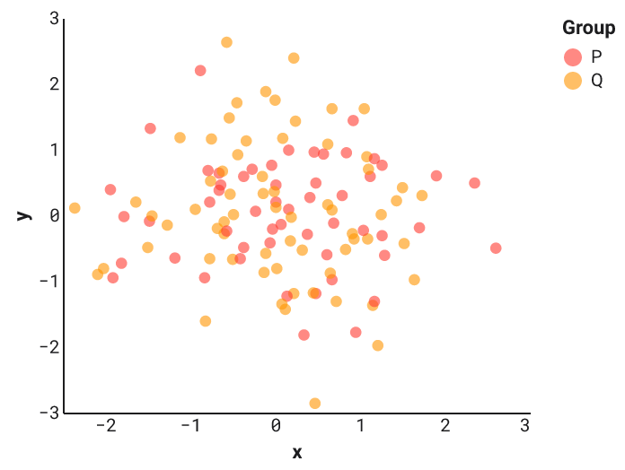 **Scatter** — `sns.scatterplot(hue=…)` · `scatter.vl.json` | 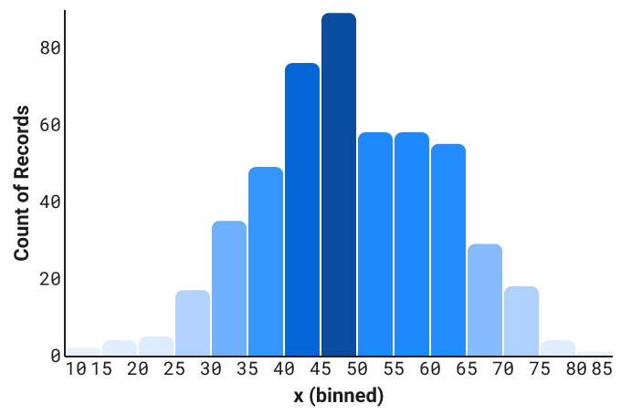 **Histogram** — `sns.histplot` · `histogram.vl.json` |

## Vega engine — advanced cases

The plots people assume need matplotlib / plotly. All Vega (or full Vega),
rendered and eyeballed.

| | |
|---|---|
| 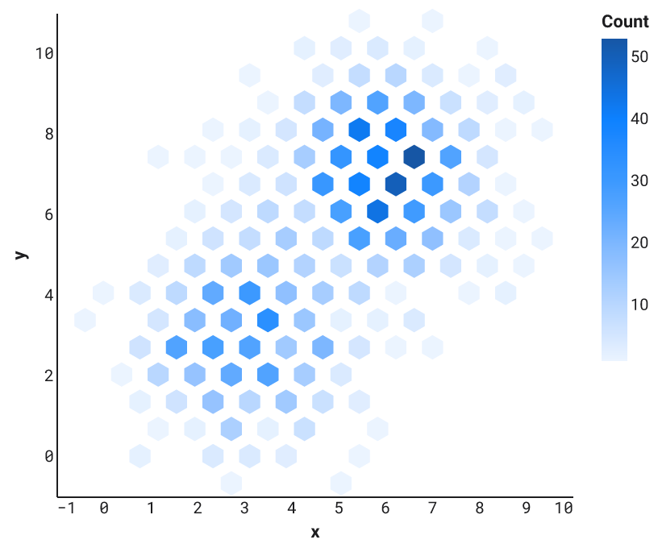 **Hexbin** — `plt.hexbin` (offline hex + hexagon shape) · `hexbin.vl.json` | 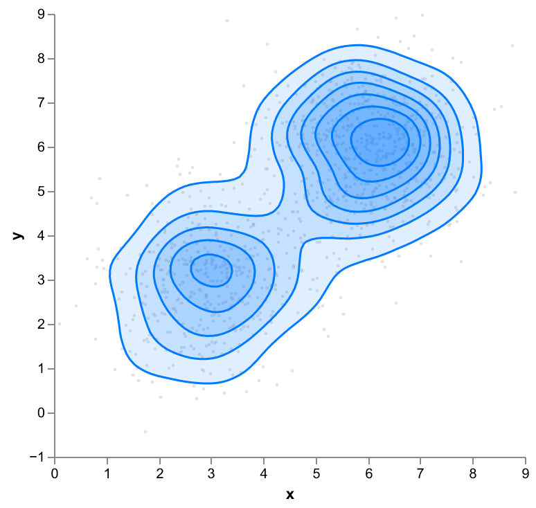 **2D-KDE contour** — `sns.kdeplot` 2D (full-Vega `kde2d`+`isocontour`) · `kde2d-contour.vg.json` |
| 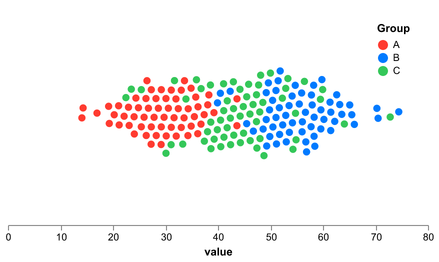 **Beeswarm** — `sns.swarmplot` (full-Vega `force`+`collide`) · `beeswarm.vg.json` | 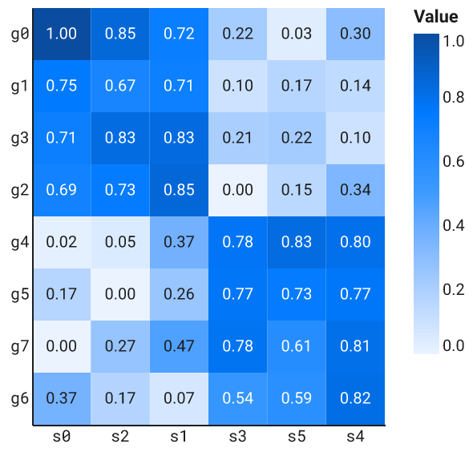 **Clustermap** — `sns.clustermap` (scipy linkage + reordered heatmap) · `clustermap.vl.json` |
| 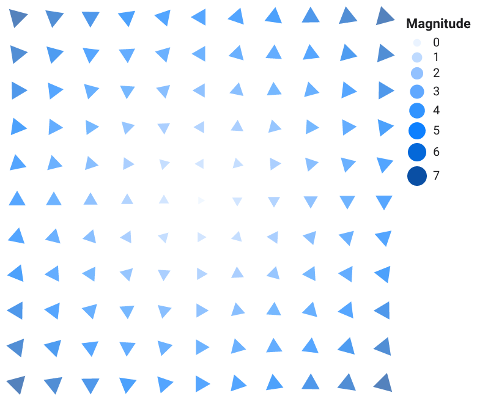 **Quiver** — `plt.quiver` (`angle` on a triangle mark) · `quiver.vl.json` | 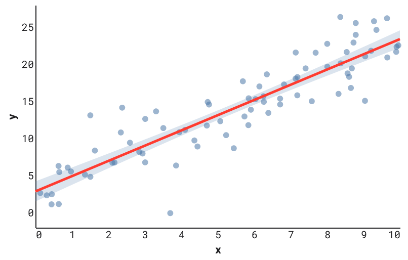 **Regression + CI band** — `sns.regplot` (offline fit + CI) · `regression-ci-band.vl.json` |
| 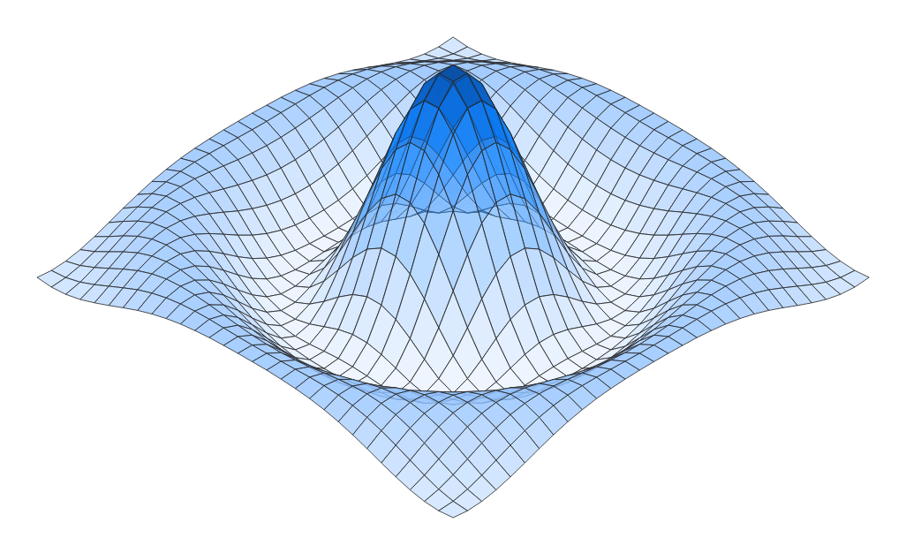 **Static 3D surface** — `plot_surface` / plotly `Surface` (offline projection + shaded polygons) · `surface-3d.vg.json` | |

## SVG engine — the escape hatch

When the Vega loop can't get there, hand-authored SVG does — rasterised with
`rsvg-convert`.

| | |
|---|---|
|  **Interpolated `imshow`** — smooth raster via `feGaussianBlur` (Vega only draws hard cells) · `svg-examples/imshow-interpolated.svg` | 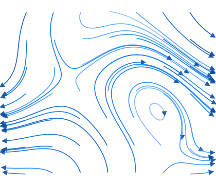 **Streamplot** — offline streamlines + arrowhead markers (Vega has no marker-end) · `svg-examples/streamplot.svg` |

## Maps — thematic cartography

Thematic maps from a vendored, offline **Natural Earth** basemap
([`assets/geo/`](assets/geo/PROVENANCE.md), public domain, 110m + 50m). Built to
the conventions the best data desks use: **Equal-Earth** (equal-area, so a
country's ink matches its real size — never Mercator for a choropleth),
**classed** color (quintiles with rounded breaks, not a raw ramp), a
**conclusion title + source line**, hairline borders, and area-true symbols
(radius ∝ √value). Choropleths render in Vega; the overlay and hand-projected
maps take the SVG path (Vega's layered `geoshape` + `lon/lat` does not render
reliably under vl-convert, and Equal-Earth polygons need antimeridian cutting +
Antarctica handling that we do offline).

| | |
|---|---|
| 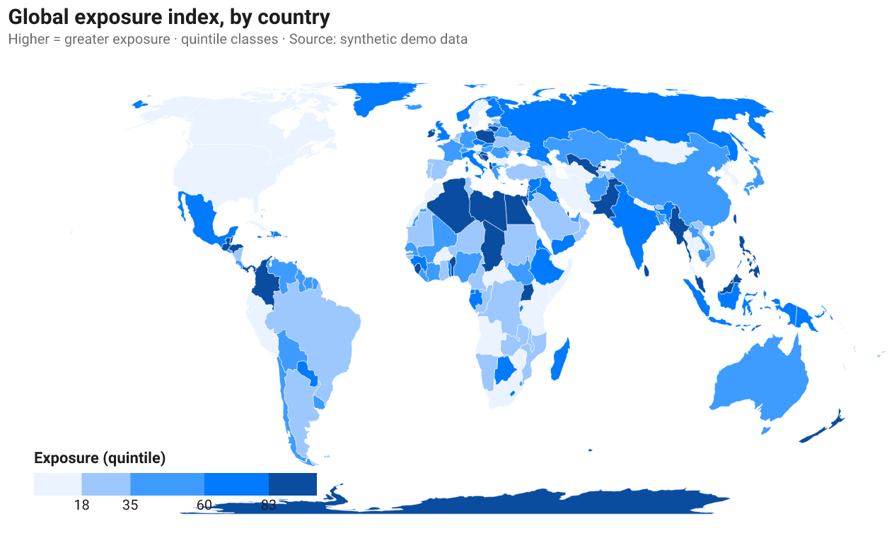 **Choropleth** — Equal-Earth, quintile classes, headline + source (Vega `geoshape` + TopoJSON lookup) · `choropleth.vl.json` | 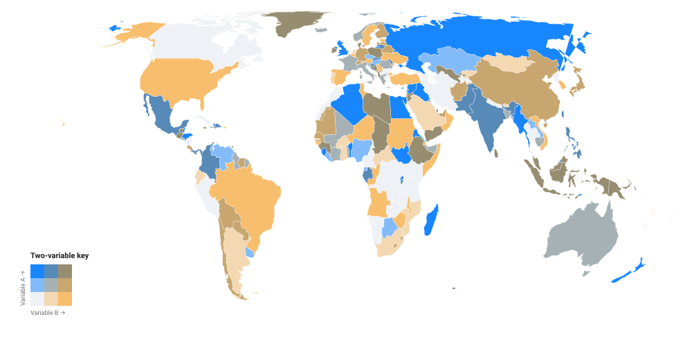 **Bivariate choropleth** — two variables on a 3×3 color key · `svg-examples/map-bivariate.svg` |
| 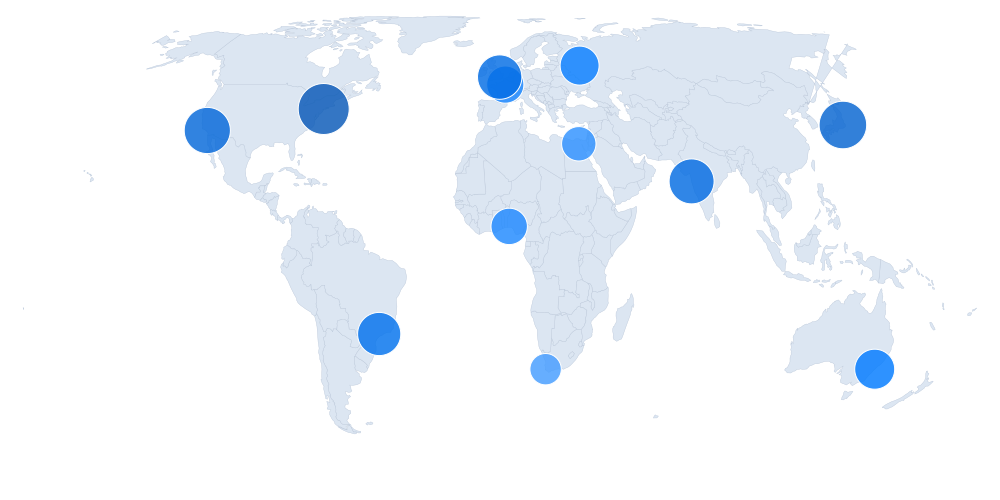 **Proportional-symbol map** — area-true √ scale · `svg-examples/map-bubble.svg` | 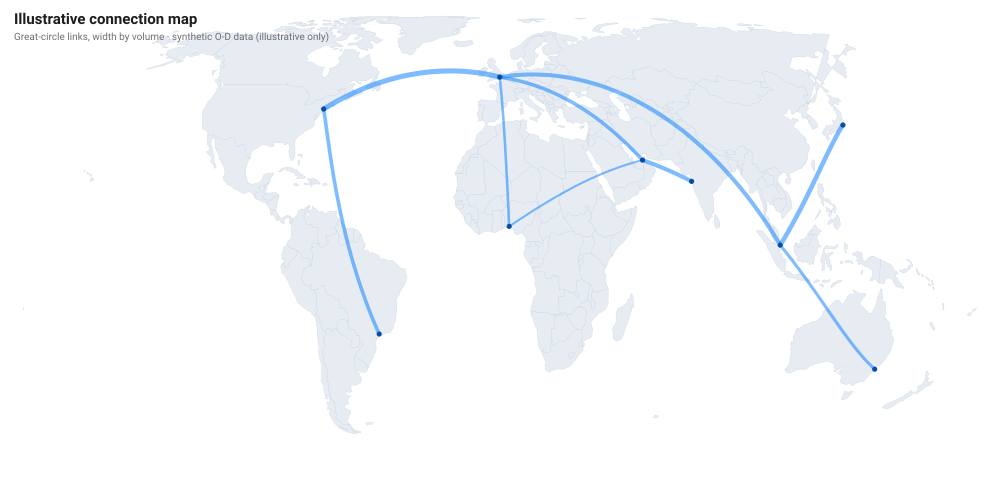 **Connection / flow map** — great-circle arcs, width by volume (label synthetic flows as illustrative) · `svg-examples/map-flow.svg` |
| 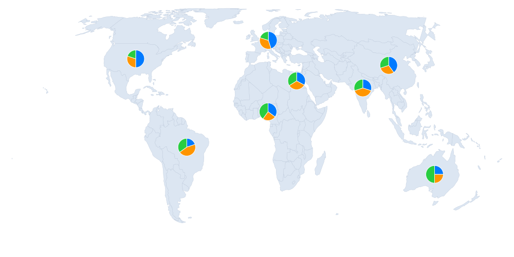 **Pie-glyph map** — a pie per region · `svg-examples/map-pie.svg` | 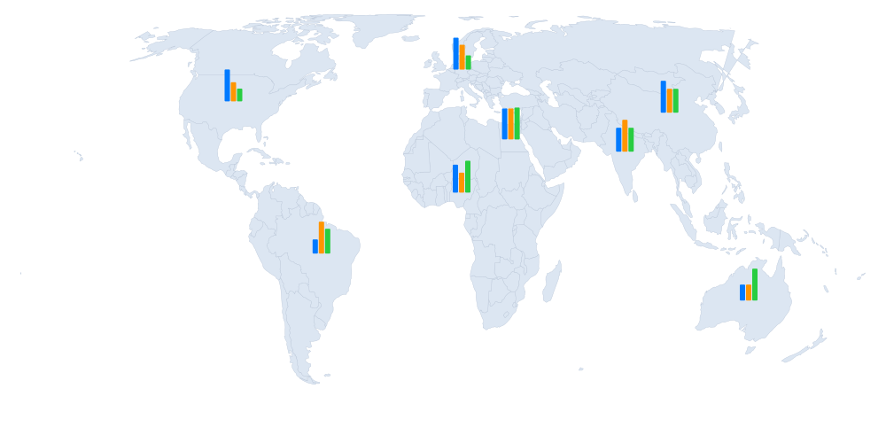 **Bar-glyph map** — mini bars per region · `svg-examples/map-bars.svg` |

Honest scope: this is thematic map **visualization**, not a GIS. Spatial
analysis — joins, buffers, CRS transforms, raster — is out of scope; use
geopandas / QGIS for that (also how you'd curate more basemap geometry, see
`assets/geo/PROVENANCE.md`).

## Plotly, specifically

Most of plotly maps onto Vega directly, and one of plotly's headline features is
a **Vega native strength**, not a gap:

- **Interactivity** (hover, zoom, pan, linked brushing) — first-class in
  Vega-Lite (`params` / `selection`); a static export drops it, but the shipped
  spec is interactive in a page.
- **Maps** (`choropleth`, `scattergeo`) — Vega-Lite `geoshape` + projections.
- **Statistical** (violin, box, density-contour, distplot) — covered above.
- **`sunburst` / `treemap` / `icicle` / `sankey` / `parallel coordinates`** —
  full-Vega layouts (`partition`, `treemap`, custom Sankey, the parallel-coords
  example).
- **`candlestick` / `OHLC` / `waterfall` / `funnel`** — Vega-Lite `rule` + `bar`
  composites.
- **3D** — static surfaces / scatter as above.

## What still isn't ours

Honestly out of reach (see `.private/vega-failures/FAILURES.md`):

- **Live-interactive 3D** — rotating a 3D camera in the browser (plotly's
  `Surface`/`Scatter3d` interactivity). Static 3D is fine; live rotation is
  three.js / plotly.
- **Animation** — temporal playback (plotly frames). A static export is one
  frame.
- **> ~50k marks** — rasterise with matplotlib / datashader.
