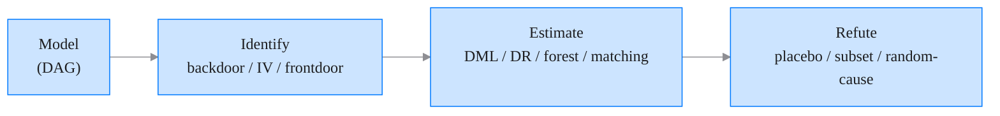

# Causality — DoWhy loop, opinionated

The canonical four-step loop for causal-effect estimation from
observational data. `causal_estimate.py` runs it end-to-end.

Sources: [DoWhy docs](https://www.pywhy.org/dowhy/),
[EconML docs](https://econml.azurewebsites.net/),
[Judea Pearl's *Book of Why*](http://bayes.cs.ucla.edu/WHY/), and
Miguel Hernán & Jamie Robins' [*Causal Inference: What If*](https://miguelhernan.org/whatifbook).

## The four-step loop



### 1. Model — supply the DAG

`causal_estimate.py --dag dag.gml` accepts:

- A **`.gml`** file — GraphML written by hand or by `networkx`.
- A **DoWhy string** via `--dag-string "graph[directed 1 node[id T] node[id Y] node[id X] edge[source T target Y] edge[source X target T] edge[source X target Y]]"`.
- A **`.dot`** file — Graphviz DOT.

You must include the treatment, the outcome, and every confounder you
believe closes the backdoor. Discovery (learning the DAG from data) is
**out of scope** — use `causal-learn` or `causal-discovery-toolbox`.

### 2. Identify — pick the estimand

DoWhy's identification engine walks the DAG and returns which of
these three strategies closes the estimand:

- **Backdoor adjustment** — a set of confounders that blocks every
  non-causal path. Most common.
- **Instrumental variable (IV)** — a variable that affects treatment
  but not outcome except through treatment. Rare in practice.
- **Frontdoor adjustment** — a mediator that captures the full effect
  of treatment on outcome, when direct confounding is unmeasured.
  Rarer still.

The script prints the identified estimand before estimating. If none
is identifiable, the run aborts with an error listing the unclosed
paths.

### 3. Estimate — pick the backend

Backend picked by treatment type and `--estimator`:

| `--estimator` | Treatment | Backend | When to use |
|---|---|---|---|
| `linear` | binary | `LinearRegressionEstimator` (DoWhy built-in) | Small N, low-dim, quick sanity check. |
| `matching` | binary | `PropensityScoreMatchingEstimator` (DoWhy) | Binary treatment, discrete confounders. |
| `stratification` | binary | `PropensityScoreStratificationEstimator` (DoWhy) | Binary treatment with many confounders. |
| `dml` | continuous or binary | `EconML.LinearDML` | Double machine learning; handles high-dim confounders. **Default when treatment is continuous.** |
| `dr` | continuous or binary | `EconML.LinearDRLearner` | Doubly robust; robust to misspecification of one nuisance. |
| `causal-forest` | continuous or binary | `EconML.CausalForestDML` | Heterogeneous treatment effects (per-row effect estimates). |
| `iv-2sls` | any (with an instrument) | `EconML.IntentToTreatDRIV` | You supplied `--instrument Z`. |

The estimator emits a **point estimate + 95 % CI** (bootstrap or
analytical, whichever the backend supports).

### 4. Refute — try to break the estimate

DoWhy's refuters do not prove causation; they try to *invalidate* the
estimate. `--refute all` runs the battery:

| Refuter | Test | Pass criterion |
|---|---|---|
| **Placebo treatment** | Replace treatment with random noise; re-estimate. | Effect should collapse to zero (within CI). |
| **Random common cause** | Add an independent random confounder; re-estimate. | Effect should not change materially (< 10 % relative shift). |
| **Data subset** | Re-estimate on a random 80 % subset. | Effect should be stable across draws. |
| **Add unobserved common cause** | Simulate a hidden confounder of known strength. | Effect should degrade gracefully, not collapse. |

`effect.json` contains the point estimate, CI, and the delta for each
refuter. **Interpret the deltas, not just the point estimate.**

## Output contract

`causal_estimate.py` writes to `<out>/`:

- `effect.json` — full run:
  ```json
  {
    "treatment": "T",
    "outcome": "Y",
    "confounders": ["X1", "X2", "X3"],
    "estimand": "backdoor",
    "estimator": "econml.LinearDML",
    "point_estimate": 0.142,
    "ci_lower": 0.093,
    "ci_upper": 0.191,
    "refutations": {
      "placebo_treatment": { "effect": 0.001, "verdict": "pass" },
      "random_common_cause": { "effect": 0.140, "delta_pct": -1.4, "verdict": "pass" },
      "data_subset": { "mean": 0.145, "std": 0.018, "verdict": "pass" }
    }
  }
  ```
- `dag.svg` — the DAG rendered via graphviz in the front-* house
  style (Roboto, curated palette, no chartjunk).
- `dag.png` — 2× PNG for embedding.
- `forest_plot.svg` — point estimate + CI + refutation deltas as a
  compact forest plot for the report.

## Guardrails

- **DAGs are assumptions, not data.** The point estimate is only as
  good as the DAG. If a confounder is missing from the DAG,
  identification will succeed but the estimate will be biased.
- **Refutation is necessary, not sufficient.** Passing all refuters
  does not prove causation. It rules out specific failure modes.
- **Don't chase p-values.** DoWhy's CIs are frequentist; effect sizes
  and refutation stability matter more than any 0.05 threshold.
- **Continuous treatment default is DML.** DML is robust to
  regularisation bias in nuisance models; the propensity-score
  methods (matching, stratification) are only for binary treatment.
- **Heterogeneous effects.** Pass `--estimator causal-forest` to get
  per-row conditional-average-treatment-effect (CATE) estimates.
  Useful when the effect varies by subgroup.

## Common failure modes

| Symptom | Likely cause | Fix |
|---|---|---|
| "Estimand not identifiable" | DAG has an open backdoor path | Add the missing confounder to the DAG or the `--confounders` list. |
| DML CI wildly wide | Overlap violated (few treated units with high-dim confounders) | Trim by propensity score (`--trim-quantile 0.05`) or reduce confounder set. |
| Placebo refuter shows a non-zero effect | Model is picking up random noise | Reduce model complexity; try `--estimator linear` first. |
| Random common cause refuter fails | Model is unstable to added noise | Try DR-learner (`--estimator dr`); it's more robust. |
| Graphviz not installed | System package missing | `brew install graphviz` (macOS — [brew.sh](https://brew.sh)) / `apt install graphviz` (Linux) / `winget install graphviz` (Windows). |

## When NOT to use this skill

- You need **causal discovery** (learn the DAG from data) — see
  `causal-learn`, `causal-discovery-toolbox`, or `pywhy-mcp`.
- You need **interrupted-time-series** (Bayesian pre-post) — see
  Google's `CausalImpact` port.
- You need **synthetic control** — see `SparseSC` or `pysyncon`.
- You need a **structural causal model** (SEM) with mediation and
  path decomposition — see `semopy` or `lavaan` (R).
