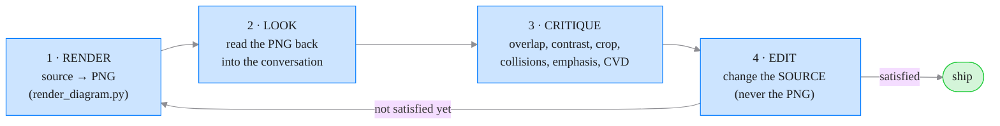

# The Ralph Eyeball Loop — never ship a graphic blind

A **graphic you generated but never looked at is a graphic you have not
finished.** Text output can be proofread by reading it back; a figure,
diagram, or chart cannot — its correctness lives in pixels, not in the
source. The **Ralph Eyeball Loop** closes that gap.

> **Ralph Eyeball Loop** — render the source to an image, *look* at the
> image, critique it, edit the **original source format**, re-render, and
> repeat until you are satisfied with what you see.

The name is literal: *Ralph* for the keep-going loop, *Eyeball* because
the agent uses its own vision as the critic. The thing you edit is never
the PNG — it is always the source (a Vega-Lite spec, a TikZ figure, a
Mermaid diagram, a GUI screen), so every iteration stays diffable,
reproducible, and editable.

## Why the agent is the critic (and the one-LLM rule still holds)

The visual judge in this loop is **the Claude Code / OpenCode agent
itself** — the model reading this repository, which can see images. It is
**not** a model embedded in any skill script. This project's absolute
one-LLM rule (gemma3:4b via Ollama, for the skills' own text generation)
is untouched: `render_diagram.py` calls no model at all. It rasterises;
you look. Nothing here adds a second model to the codebase.

## The loop

<!-- This doc practices what it preaches: the loop is a colored Mermaid
     diagram, not ASCII art. Palette hues from front-colors. -->



Concretely, for any of the source kinds:

```bash
# 1. render
python front-figures/scripts/render_diagram.py fig.vl.json \
    --background white --out /tmp/fig.png
# 2. look  → Read /tmp/fig.png   (the agent views the image)
# 3-4. critique, then edit fig.vl.json
# 5. re-render and look again
```

Stop when the critique comes back empty — the axis reads, nothing
overlaps, the emphasis lands where the data's story is, the palette is
CVD-safe, the crop is tight. Not before.

## What "look" should catch

The auditor (`audit_figure.py`) catches mechanical sins from the *source*
(missing labels, dual axes, truncated baselines, rainbow palettes). The
Eyeball Loop catches what only appears once rendered:

- Overlapping / clipped tick labels, legends off-canvas, collided nodes.
- Emphasis in the wrong place — the eye going to chartjunk, not the point.
- Contrast that fails on the chosen background (run `front-colors`
  `simulate_cvd.py` on the same PNG for a color-vision check).
- Crop / whitespace / aspect-ratio problems.
- A diagram that is *correct* but *unreadable*.

Run the auditor **and** the loop; they cover different failures.

## Never ASCII art — always colored Mermaid

**Do not draw diagrams in ASCII art.** A `+----+  --->  [ box ]` sketch in
a code fence or a docstring is unreadable, un-styleable, and impossible to
maintain — it is the diagram equivalent of shipping a figure blind.

When you are tempted to reach for box-drawing characters, write a
**Mermaid** diagram instead and render it through this loop. Mermaid is
first-class here because `render_diagram.py` injects the **front-colors
palette** as its theme (`%%{init}%%`) — so you get on-brand, colored,
readable nodes and edges for free, then eyeball and refine:

```bash
python front-figures/scripts/render_diagram.py flow.mmd \
    --background transparent --out flow.png    # then look, then refine flow.mmd
```

The rule, as a strict preference order:

> **Ralph-Eyeball-Loop Mermaid-with-colors  >  Mermaid + colors  >  ASCII art**

That is: a colored Mermaid diagram you have actually *rendered, looked at,
and refined* through this loop beats one you merely wrote with colors,
which in turn beats ASCII art (which is never acceptable). Writing the
Mermaid is not the finish line — eyeballing the rendered image is. Reach
for TikZ when the figure is mathematical / print-grade, and Vega when it
is a data chart — but never leave a diagram as ASCII, and never leave a
diagram un-eyeballed.

## Source kinds and how they render

`scripts/render_diagram.py` is the single renderer. It auto-detects the
kind from the extension or first line (override with `--kind`).

| Kind | Source | Toolchain | Notes |
|---|---|---|---|
| **vega** | Vega-Lite v5 (or full Vega) JSON | `vl-convert-python` (one wheel, bundles Vega, offline) | Rasterises the **real spec that ships** — what you eyeball is what the browser draws. `--format svg`/`pdf` for vector print. |
| **tikz** | LaTeX / TikZ figure | `tectonic` (or `pdflatex`/`latexmk`) + `pdftoppm`/`magick` | Bare `tikzpicture` fragments are auto-wrapped in a `standalone` document. |
| **mermaid** | Mermaid diagram | `mmdc` (mermaid-cli) | `%%{init}%%` theme injected from the palette. |
| **gui** | A rendered web UI | headless browser capture (front-ui / front-cli-gui) | Screenshot the page, look, refine the HTML/JS. Same loop, different renderer. |

GUI is not handled by `render_diagram.py` — front-ui and front-cli-gui
already screenshot a page headlessly. The **loop** is the same: capture →
look → edit the markup → re-capture.

## Prefer Vega — always, where you have the choice

For any chart that Vega-Lite can express, **prefer it over matplotlib /
seaborn / pyplot**. Three reasons, in order:

1. **The spec carries its own data.** A Vega-Lite `.json` is figure +
   data + encoding in one file — auditable, diffable, and re-traceable.
   In science that is a feature: a reader can re-plot or re-analyse from
   the artifact itself. A matplotlib PNG is a dead end.
2. **It is the house rendering path.** `_style.vega_config` themes it;
   it drops straight into a front-ui page; the Eyeball Loop rasterises
   the *actual* spec, not a re-draw.
3. **It is enough.** See `references/vega-gallery.md` — every common
   statistical chart, and the extractable explainability plots (SHAP,
   LIME, importance, PD/ICE, DAG), have an idiomatic Vega-Lite/Vega form.

matplotlib stays only as an escape hatch for the genuine residue Vega
cannot do (true 3D surfaces, filled contour fields, dendrograms,
Sankey/chord/treemap, quiver fields, and >~50k-point rasterisation) —
enumerated honestly in `references/vega-gallery.md`.

## Palette first

Every kind is themed from the **canonical front-colors palette**
(`front-colors/references/palette.csv`, the tokens documented at
<https://harchaoui.org/warith/colors/>) before you render — TikZ via a
`\definecolor` preamble, Mermaid via the injected `%%{init}%%` theme,
Vega via `_style.vega_config`. This is the *starting* palette, not a
lock-in: reach for these colors first, then edit specific hues in the
source if a figure needs it. Pass `--no-theme` to render a source
exactly as written.

## Background: white or transparent, per the embedding

Set the canvas to match where the graphic lands:

- `--background white` — drop onto a light page / print.
- `--background transparent` — overlay, or a dark hero / dark-mode page.
- `--background dark` — the house dark canvas (`#1D1D1F`).
- `--background auto` — follow `--dark`.
- `--background '#RRGGBB'` — anything explicit.

For Vega the default compiled background is **white**; the renderer sets
`transparent` explicitly when asked, never by omission.
