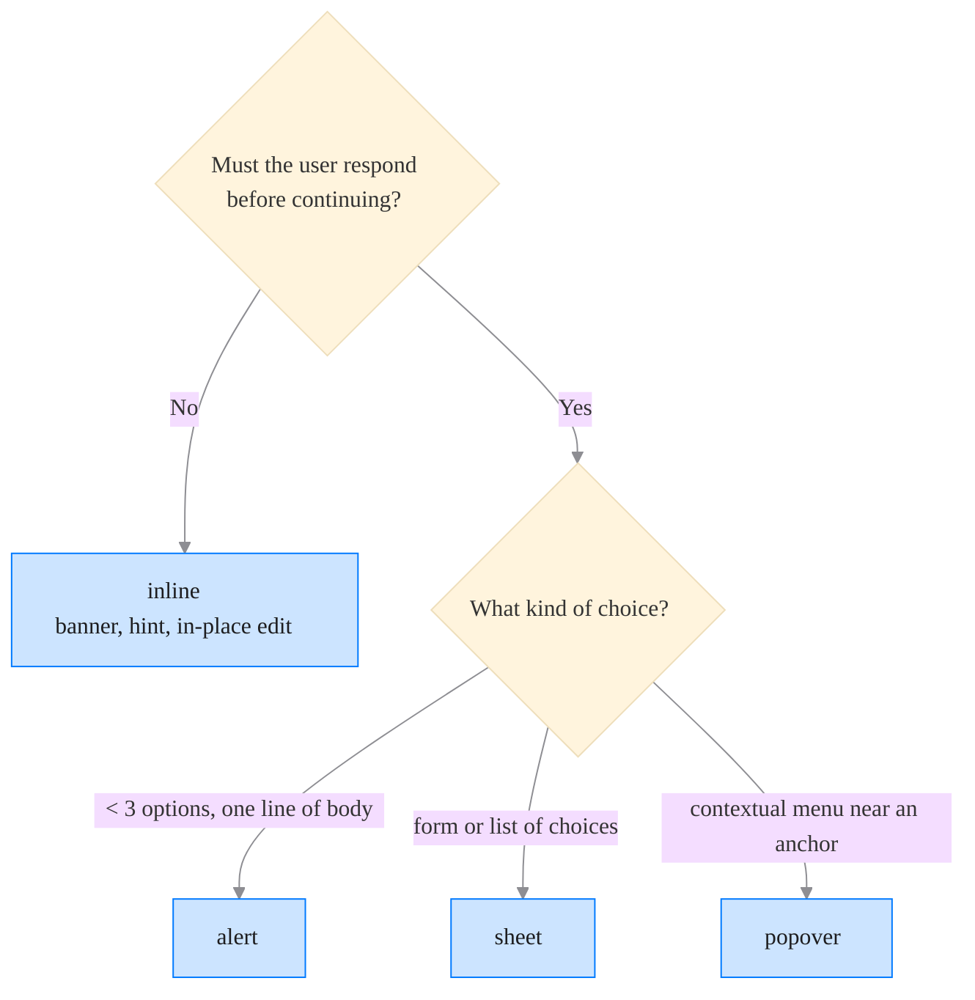

# Patterns — Modality

## When to consult this file

- Anything that interrupts: dialog, sheet, alert, popover
- Picking between modal and inline UI

## Core principles

- **Modality blocks focus.** Only block focus when the user must respond before continuing.
- **Choose the lightest fitting surface**: inline > popover > sheet > alert.
- **Always offer dismissal.** Backdrop click, Escape, explicit Close.
- **Restore focus** to the trigger on close.

## Decision tree

## Concrete rules

1. Prefer native `<dialog>` over div-built modals.
2. Trap focus inside; restore on close.
3. `Escape` closes; backdrop click closes; trailing close button present.
4. No more than ONE modal level deep.
5. Don't open a modal during page load — that's pop-up behavior.

## Checklist

- [ ] Modal warrants blocking focus.
- [ ] Dismissal: Escape + backdrop + button.
- [ ] Focus restored to trigger.
- [ ] No nested modal.
