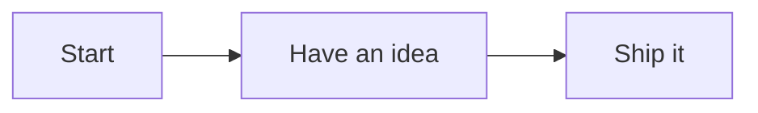

# The Gettysburg Address

> Public-domain text by Abraham Lincoln, November 19, 1863.
> Used here as a stable, copyright-free fixture for front-publish tests.

## Speech

Four score and seven years ago our fathers brought forth on this continent,
a new nation, conceived in Liberty, and dedicated to the proposition that
all men are created equal.

Now we are engaged in a great civil war, testing whether that nation, or
any nation so conceived and so dedicated, can long endure. We are met on
a great battle-field of that war.

We have come to dedicate a portion of that field, as a final resting
place for those who here gave their lives that that nation might live. It
is altogether fitting and proper that we should do this.

## Mermaid example

## LaTeX example

A simple inline formula: $E = mc^2$.

A multi-line display formula:

$$
\begin{align}
a &= b + c \\
  &= d + e
\end{align}
$$

## Image example

## Link example

[Local link to itself](gettysburg.md)
